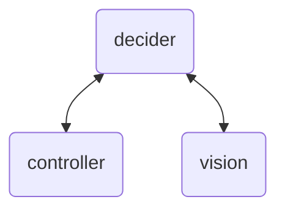
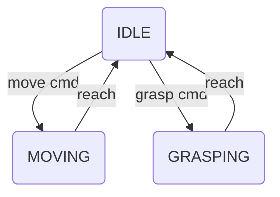

# UR5_Vision_Assemble
Use ROS2 and Gazebo to simulate 2 UR5 assembling objects. 

## Environment

* Ubuntu 22.04
* ROS2 IRON
* Gazebo Fortress

## Workflow

The architecture is organized in 3 parts:

* `decider` collects data, like configuration of UR5 and object pose recognized by camera, from another two parts. Then it will send command to `controller` and `vision` according to both the pre-set logic and human command. 
* `controller` controls the motion of UR5
* `vision` use yolov5 to recognize the object and calculate its coordinate and orientation.

## Controller design roadmap

### Interface 

* IN: 
    * From `decider`
        * mode (0: stop, 1: pose, 2: config)
        * target end effector pose
        * target joint configuration
    * From gazebo
        * UR5 state

* OUT:
    * To `decider`
        * current state (stop, moving, grasping, etc.)
    * To gazebo
        * joint control command

### Main loop

We need to 
* Plan the path in joint space or task space. 
* PD control.

Simple state transition

### Code design

Use a `UR5` class to manage: 
* receiving command from `decider` and sending feedback to it. 
* obtain current robot state from gazebo and give control command to it. 
* use Moveit! to solve the problem of path planning, inverse kinematics, etc. 

Note that there are two robot arms in simulation thus the class should have id. 

